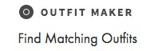

# OM prototype documentation

## Inject script
Copy and paste the following code snippet to the *cjs* Chrome extension.

	(function() {
	    var logStyle = 'color:#2980b9;padding:2px 50px;font-size:20px;line-height: 60px;border:1px dashed #2980b9';

	    function loadScript(url, callback) {
	        var script = document.createElement('script');
	        script.type = 'text/javascript';

	        script.onload = function() {
	            callback();
	        };

	        script.src = url;
	        document.getElementsByTagName('head')[0].appendChild(script);
	    }

	    loadScript('https://ajax.googleapis.com/ajax/libs/jquery/3.1.1/jquery.min.js', function() {
	        var localUrl = 'https://localhost:8000/script.js';
	        var remoteUrl = 'https://s3.amazonaws.com/sspinc-usability/outfitmaker/nordstrom-rack/script.js';
	        loadScript(localStorage.omLocal === 'true' ? localUrl : remoteUrl, function() {
	            console.log('%cUSER TESTING SCRIPT LOADED', logStyle);
	        })
	    });
	})();

## Version 1

If any items are locked on the first page, the user can navigate to the second page, on which items can be purchased.

	localStorage.omVersion = 1

## Version 2

If any items are locked on the first page, `Save outfit` button becomes available. Saved outfits can be seen on the second page.

	localStorage.omVersion = 2

## Version 3

No second screen is available, the user can only generate outfits and navigate to them from the first page.

	localStorage.omVersion = 3

## UI Variants

### Header

#### Header text

Sets the displayed text (except for the logo's text, which is always *Outfit Maker*) of the section header. If only logo should be shown, this can be disabled.

(From this point refered to as *Header text*)

**Enable:**

	localStorage.omHeaderText = "Find matching outfits"

**Disable:**

	delete localStorage.omHeaderText

#### Logo

Sets the visibility of the Outfit Maker logo in the section header.

**Enable:**

	localStorage.omHeaderLogo = true

**Disable:**

	localStorage.omHeaderLogo = false

#### Order of the logo

Sets whether the logo is displayed before or after the *Header text*, provided that *Header text* is set (*localStorage.omHeaderText*).

**Before Header text:**

	localStorage.omHeaderLogoFirst = true

**After Header text:**

	localStorage.omHeaderLogoFirst = false

#### Header label

Sets the visibility of the header label in the section header. If Outfit Maker logo is displayed, the label will follow the logo, otherwise it will follow the *Header text*.

**Enable:**

	localStorage.omHeaderLabel = true

**Disable:**

	localStorage.omHeaderLabel = false

#### Header label text

Sets the displayed text of the header label. Defaults to *"New!"*.

**Change label text:**

	localStorage.omHeaderLabelText = 'Beta'

#### Header style

**Variant 1** - Has separator lines before and after section header (like *You May Also Like* on the PDP):

	localStorage.omHeaderStyle = 1

> With the lined header style only one line of text can be displayed, so either *Header text* or the Outfit Maker is shown, but needs to be set explicitly: if the logo should be shown, disable *Header text* and vice versa.

**Variant 2** - Doesn't have separator lines, section header is aligned to the center:

	localStorage.omHeaderStyle = 2

### Match cards

**Variant 1** - Default Variant with the locks in the corners:

	localStorage.omCardVariant = 1

**Variant 2** - *"Lock item"/"Unlock item"* button appears on cards on hover with tooltip:

	localStorage.omCardVariant = 2

### Refresh button

**Variant 1** - The well known version:

	localStorage.omRefreshVariant = 1

**Variant 2** - A slightly lifted version based on circular floated action button UX recommendations, also has a little hover animation.

	localStorage.omRefreshVariant = 2

### My Saved Outfits

#### Outfit alignment

**Variant 1** - Outfits are aligned to the center:

	localStorage.omOutfitLeftAligned = false

**Variant 2** - Outfits are aligned to the left:

	localStorage.omOutfitLeftAligned = true

## Extra features

### *My Saved Outfits* in Account menu

**Enable:**

	localStorage.omAccountMenuLink = true

**Disable:**

	localStorage.omAccountMenuLink = false

### *My Saved Outfits* in primary site navigation

**Enable:**

	localStorage.omPrimaryNavLink = true

**Disable:**

	localStorage.omPrimaryNavLink = false

