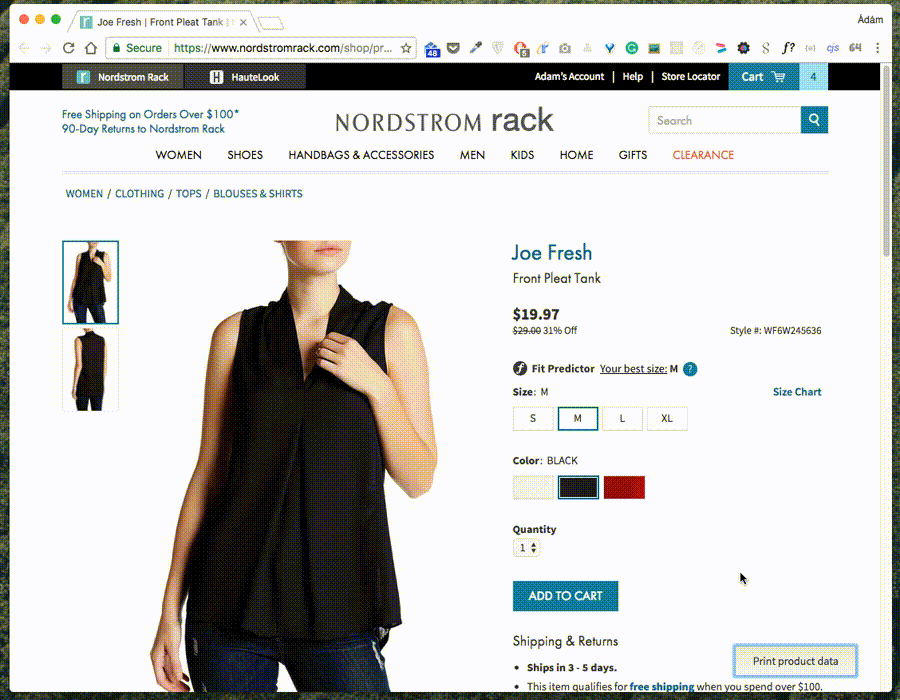

# Product data gathering

## Inject data gathering script
Copy and paste the following code snippet to the *cjs* Chrome extension.

	( function() {
	  function loadScript(url, callback) {
	    var script = document.createElement('script');
	    script.type = 'text/javascript';

	    script.onload = function() {
	      callback();
	    };

	    script.src = url;
	    document.getElementsByTagName('head')[0].appendChild(script);
	  }

	  function requestProductInfo(id) {
	    var deferred = $.Deferred();
	    $.get('https://www.nordstromrack.com/api/nrhl/products/' + id, function(data) {
	      deferred.resolve(data);
	    }).fail(function(err) {
	      console.log('error occured while fetching product info for product ' + id);
	      console.log(err);
	      deferred.reject();
	    });

	    return deferred.promise();
	  }

	  function createElement(type, className, id, text) {
	    return $('<' + type + '/>', {
	      class: className,
	      id: id,
	      text: text
	    });
	  }

	  function getQueryStringValue(key) {
	    return decodeURIComponent(window.location.search.replace(new RegExp("^(?:.*[&\\?]" + encodeURIComponent(key).replace(/[\.\+\*]/g, "\\$&") + "(?:\\=([^&]*))?)?.*$", "i"), "$1"));
	  }

	  function printProductData() {
	    var path = window.location.pathname;
	    var startIndex = path.indexOf('product/') + 8;
	    var endIndex = path.indexOf('/', path.indexOf('product/') + 8) > -1 ? path.indexOf('/', path.indexOf('product/') + 8) : undefined;
	    var id = path.substring(startIndex, endIndex);

	    requestProductInfo(id).then(function(product) {
	      console.log(product);

	      var color = getQueryStringValue('color');
	      var images = [];

	      var colors = product._embedded['http://hautelook.com/rels/variations'].colors;

	      for (var i = 0; i < colors.length; i++) {
	        if (colors[i].color === color) {
	          $.each(colors[i]._links['http://hautelook.com/rels/images'], function(index, image) {
	            images.push(image.href);
	          });
	          break;
	        }
	      }

	      var productInfo = {};
	      productInfo.id = id;
	      productInfo.brand = product.brand_name;
	      productInfo.name = product.name;
	      productInfo.salePrice = product._embedded['http://hautelook.com/rels/skus'][0].price_sale.toFixed(2);
	      productInfo.price = product._embedded['http://hautelook.com/rels/skus'][0].price_retail.toFixed(2);
	      productInfo.discount = product._embedded['http://hautelook.com/rels/skus'][0].price_discount;
	      productInfo.color = color;
	      productInfo.images = images;
	      productInfo.displayImage = 0;

	      alert(JSON.stringify(productInfo, null, 4) + ',');
	    });
	  }

	  loadScript('https://ajax.googleapis.com/ajax/libs/jquery/3.1.1/jquery.min.js', function() {
	  	$('body').append(createElement('button', null, null, 'Print product data')
	  		.click(printProductData)
	  		.css({
	  			position: 'fixed',
	  			bottom: 0,
	  			right: 0,
	  			margin: '20px 30px',
	  			padding: '10px 20px',
	  			zIndex: 1000
	  		}));
	  });
	} )()

## Get product data

Once this script is enabled through *cjs*, set the desired color on the PDP and click the *Print product data* button in the bottom right corner of the screen. A popup will show up with the a JSON object that contains all the necessary product information for OM.

Copy it to a file, collect items in separate files per domain:

* `tops.json`
* `bottoms.json`
* `jewelries.json`
* `shoes.json`
* `bags.json`
